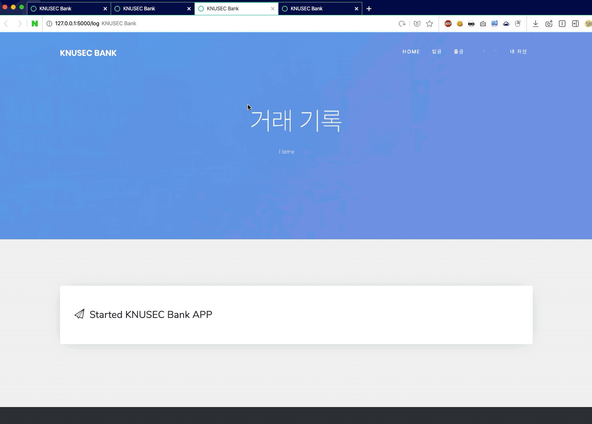

# KNUSEC 2019 Project

공주대학교 정보보호 영재교육원 2019 프로젝트 발표 대회  
쓰레드 상호 배제의 필요성과 이 때문에 발생할 수 있는 Race Condition 취약점을 시연

## Develeopment Environment (Dependencies)

* Mac OS X
* Python 3.7.4
* Flask 1.1.1

## Vulnerability

1. 출금 `500,000원` -> 잔액 체크, `500,000` 만원 인출 작업 `#1` 시작
2. 출금 `500,000원` -> 잔액 체크, `500,000` 만원 인출 작업 `#2` 시작
3. `#1` 인출 작업 완료
4. `#2` 인출 작업 종료

출금 작업 중에 Race Condition 취약점에 대한 패치를 해야 함

## Patch

`MutexWallet` 을 사용하고, 출금, 입금의 각 메인 루틴에 `acquire`, `release` 를 사용하여 `Mutex Lock`

## Demonstration

